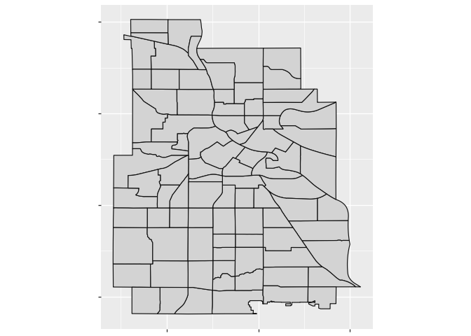
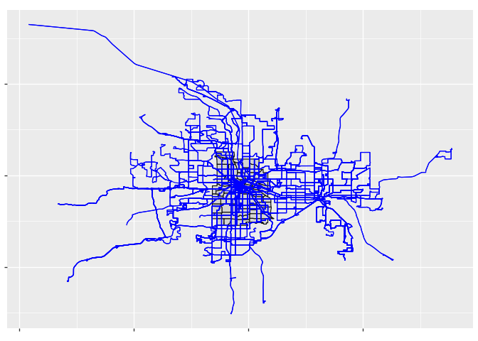
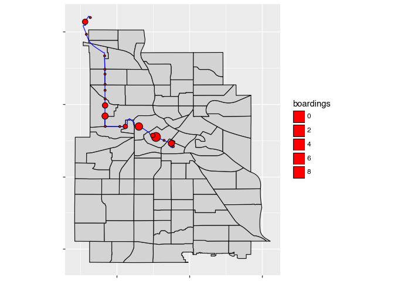

# Example analysis


## Load data

### Vehicle schedules, locations, and passenger counts

``` python
import polars as pl
import polars.selectors as cs
import polars_st as st
from datetime import date

# import polars_st as st


def to_snake_case(s: str) -> str:
    # * VehicleScheduleID -> vehicle_schedule_id
    # * RouteID -> route_id
    # * week_start -> week_start
    res: list[str] = [s[0].lower()]
    for crnt, prev in zip(s[1:], s[:-1]):
        if crnt.isupper() and prev.isupper():
            # no underscore
            res.append(crnt.lower())
        elif crnt.isupper() and prev.islower():
            res.append("_" + crnt.lower())
        else:
            res.append(crnt.lower())

    return "".join(res)


def tidy_select(df: pl.DataFrame, *cols: cs._selector_proxy_) -> pl.DataFrame:
    """Equivalent to using df.select with selectors, except removes duplicate names.

    This function works around an annoying issue, where cs.all() will raise an
    error, unless you exclude any other selections from it.
    """

    res = {}
    for sel in cols:
        for match in cs.expand_selector(df, sel):
            res[match] = True

    return df.select(*list(res))


cs_id = cs.ends_with("id")

tbl_schedule = pl.read_parquet("data/cline_2022_present/cline_sch.parquet").rename(
    to_snake_case
)

tbl_trip_stop_apc = (
    pl.read_parquet("data/cline_2022_present/apc.parquet")
    .rename(to_snake_case)
    .with_columns(
        calendar_date=pl.col("calendar_id")
        .cast(pl.String)
        .str.strptime(pl.Date, "1%Y%m%d")
    )
    .pipe(
        tidy_select,
        cs.starts_with("calendar"),
        cs.by_name("internal_trip_number"),
        cs.ends_with("id"),
        cs.all(),
    )
)

tbl_trip_stop_avl = (
    pl.read_parquet("data/cline_2022_present/stop_crossings.parquet")
    .rename(to_snake_case)
    .pipe(tidy_select, cs.ends_with("id"), cs.all())
)
```

### GTFS schedule trips and shapes

``` python
# GTFS_DATE = "2022-10-08"
gtfs_trips = pl.read_parquet(f"data/1-gtfs_schedules_combined/trips.parquet")
gtfs_stops = pl.read_parquet(f"data/1-gtfs_schedules_combined/stops.parquet")
gtfs_stop_times = pl.scan_parquet(
    f"data/1-gtfs_schedules_combined/stop_times/*/*.parquet"
)

gtfs_trip_shapes = pl.read_parquet("data/1-gtfs_trip_shapes.parquet")
```

``` python
tbl_daily_feed_dates = pl.read_parquet("data/1-daily_feed_dates.parquet")

tbl_daily_service = pl.read_parquet("data/1-daily_service.parquet")

tbl_gtfs_trips = gtfs_trips.with_columns(
    internal_trip_number=pl.col("trip_id").str.split("-").list.get(0).cast(pl.Int64())
)

# one row per trip, with a list of stop ids
# this takes a few minutes to compute
#tbl_trip_stops_nested = (
#    gtfs_stop_times.group_by(["feed_date", "trip_id"]).agg("stop_id").collect()
# )
```

### Plotting trip shapes

``` python
import pandas as pd
import geopandas as gpd
from plotnine import *


def from_wkb(wkb: pd.Series):
    return gpd.GeoSeries.from_wkb(wkb)


neighborhoods = gpd.read_file(
    "data/neighborhoods/Minneapolis_Neighborhoods.shp"
).to_crs(4326)

plot_base_map = (
    ggplot()
    + geom_map(
        neighborhoods,
        fill="lightgrey",
    )
    + theme(axis_text_x=element_blank(), axis_text_y=element_blank())
    + coord_fixed()
)

plot_base_map
```



``` python
(
    plot_base_map
    + geom_map(
        aes(geometry="from_wkb(geometry)"),
        color="blue",
        data=gtfs_trip_shapes.filter(pl.col("feed_date") == pl.col("feed_date").max()),
    )
)
```



### Plotting passenger counts for stops on a trip

``` python
from datetime import date

TRIP_NUMBERS = [22199718]
CALENDAR_DATE = date(2022, 10, 10)

filtered_apc_stops = (
    tbl_trip_stop_apc.filter(
        pl.col("internal_trip_number").is_in(TRIP_NUMBERS),
        pl.col("calendar_date") == CALENDAR_DATE,
    )
    .join(tbl_daily_feed_dates, ["calendar_date"])
    .join(gtfs_stops, ["feed_date", "stop_id"])
    .with_columns(geometry=st.from_xy("stop_lon", "stop_lat"))
)

filtered_apc_trips = filtered_apc_stops.unique(["feed_date", "internal_trip_number"])


filtered_trips = (
    tbl_gtfs_trips.join(
        filtered_apc_trips,
        ["feed_date", "internal_trip_number"],
    )
    # internal_trip_number corresponds to multiple trip_ids, but only
    # one will be in service on a given date, so need to filter based on
    # daily service schedule
    .join(
        tbl_daily_service.rename({"service_date": "calendar_date"}).filter(
            pl.col("is_in_service")
        ),
        ["feed_date", "calendar_date", "service_id"],
    )
)

filtered_trip_shapes = filtered_trips.select("feed_date", "trip_id", "shape_id").join(
    gtfs_trip_shapes.select("feed_date", "shape_id", "geometry"),
    on=["feed_date", "shape_id"],
)
```

``` python
(
    plot_base_map
    + geom_map(
        aes(geometry="from_wkb(geometry)"), color="blue", data=filtered_trip_shapes
    )
    + geom_map(
        aes(geometry="from_wkb(geometry)", size="boardings"),
        fill="red",
        data=filtered_apc_stops,
    )
)
```


